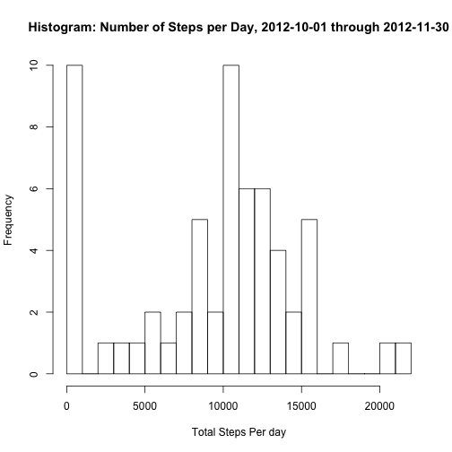
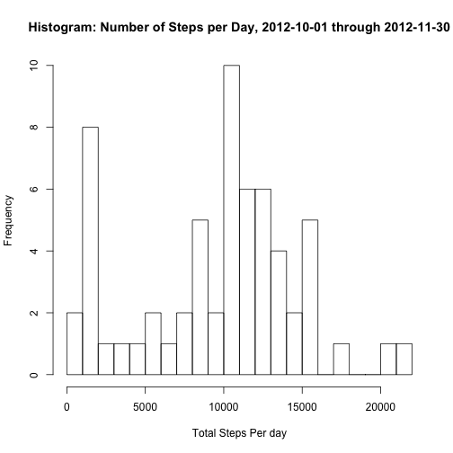
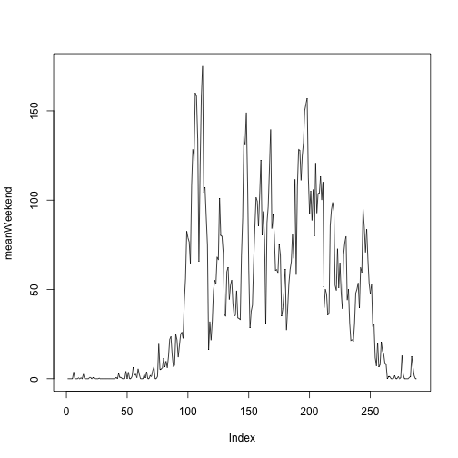

# Reproducible Research: Peer Assessment 1


## Loading and preprocessing the data
Data contains many "NA" values, for some days all data points are "NA"s
clean up white space also

```r
library(knitr)
rawData <- data.frame(read.csv("activity.csv"))
DataNoNAs <-rawData[complete.cases(rawData),]
```


## What is mean total number of steps taken per day?
The "NA" values are ignored for this calcualtion, Days with "NA"'s for all data points for  that day are reported as 0 steps per day, and average and median as 0 also.


```r
#split(rawData,list(rawData$date))
sumPerDay <- sapply(split(DataNoNAs,list(DataNoNAs$date)),function(x) sum(x$steps,na.rm=TRUE) )
plot(sumPerDay,type="h")
```

 

```r
mean(sumPerDay)
```

```
## [1] 9354
```

```r
median(sumPerDay)
```

```
## [1] 10395
```


## What is the average daily activity pattern?


```r
meanPerInterval <- sapply(split(DataNoNAs,list(DataNoNAs$interval)),function(x) mean(x$steps,na.rm=TRUE) )
colnames(meanPerInterval) <- c("mean of 5min intervals")
```

```
## Error: attempt to set 'colnames' on an object with less than two
## dimensions
```

```r
#Make a time series plot (i.e. type = "l") of the 5-minute interval (x-axis) and the average number of steps taken, averaged across all days (y-axis)


plot(meanPerInterval,type="l")
```

 

```r
#Which 5-minute interval, on average across all the days in the dataset, contains the maximum number of steps?


max(meanPerInterval)
```

```
## [1] 206.2
```

```r
#max doesn't return which interval, so using sort
sort(meanPerInterval,decreasing=TRUE)[1]
```

```
##   835 
## 206.2
```

```r
#sapply(split(DataNoNAs,list(DataNoNAs$date)),function(x) mean(x$steps,na.rm=TRUE) )
```


## Imputing missing values

Calculate and report the total number of missing values in the dataset (i.e. the total number of rows with NAs)


```r
sum(is.na(rawData$steps))
```

```
## [1] 2304
```

```r
sum(is.na(rawData$date))
```

```
## [1] 0
```

```r
sum(is.na(rawData$interval))
```

```
## [1] 0
```


Devise a strategy for filling in all of the missing values in the dataset. The strategy does not need to be sophisticated. For example, you could use the mean/median for that day, or the mean for that 5-minute interval, etc.

Strategy:  will replace NA values with median value for that interval accross all days. 

Create a new dataset that is equal to the original dataset but with the missing data filled in.


```r
#create vector of median values for intervals
medianPerInterval <- sapply(split(DataNoNAs,list(DataNoNAs$interval)),function(x) median(x$steps,na.rm=TRUE) )
#replace the "NA"'s
replaceNAs.df <- rawData
indx <- which(is.na(replaceNAs.df$steps==TRUE))
for (i in 1:length(indx) ) {
replaceNAs.df[indx[i],1]  = medianPerInterval[[as.character(replaceNAs.df[indx[i],3])]]
}
sumPerDay.ReplaceNAs <- sapply(split(replaceNAs.df,list(replaceNAs.df$date)),function(x) sum(x$steps,na.rm=TRUE) )
plot(sumPerDay.ReplaceNAs,type="h")
```

 

```r
mean(sumPerDay.ReplaceNAs)
```

```
## [1] 9504
```

```r
median(sumPerDay.ReplaceNAs)
```

```
## [1] 10395
```


Make a histogram of the total number of steps taken each day and Calculate and report the mean and median total number of steps taken per day. Do these values differ from the estimates from the first part of the assignment? What is the impact of imputing missing data on the estimates of the total daily number of steps?


## Are there differences in activity patterns between weekdays and weekends?

```r
weekends <- subset(replaceNAs.df, weekdays(as.Date(replaceNAs.df$date)) == "Sunday" | weekdays(as.Date(replaceNAs.df$date)) == "Saturday")

weekdays <- subset(replaceNAs.df, weekdays(as.Date(replaceNAs.df$date)) != "Sunday" & weekdays(as.Date(replaceNAs.df$date)) != "Saturday")

meanWeekend <- sapply(split(weekends,list(weekends$interval)),function(x) mean(x$steps,na.rm=TRUE) )
meanWeekday <- sapply(split(weekdays,list(weekdays$interval)),function(x) mean(x$steps,na.rm=TRUE) )
plot(meanWeekend,type="l")
```

 

```r
plot(meanWeekday,type="l")
```

 

```r
weekends <- subset(DataNoNAs, weekdays(as.Date(DataNoNAs$date)) == "Sunday" | weekdays(as.Date(DataNoNAs$date)) == "Saturday")

weekdays <- subset(DataNoNAs, weekdays(as.Date(DataNoNAs$date)) != "Sunday" & weekdays(as.Date(r$date)) != "Saturday")
```

```
## Error: object 'r' not found
```

```r
meanWeekend <- sapply(split(weekends,list(weekends$interval)),function(x) mean(x$steps,na.rm=TRUE) )
meanWeekday <- sapply(split(weekdays,list(weekdays$interval)),function(x) mean(x$steps,na.rm=TRUE) )
plot(meanWeekend,type="l")
```

 

```r
plot(meanWeekday,type="l")
```

 
